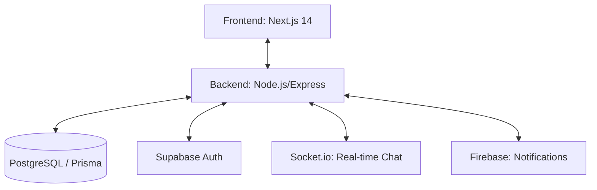

# MujMart: The MUJ Student Marketplace 🛒

MujMart is a specialized community-driven marketplace built exclusively for Manipal University Jaipur (MUJ) students. It facilitates buying, selling, and renting items within the campus ecosystem, featuring a unique anonymous negotiation system.

---

## 🏗 System Architecture

MujMart follows a modern **Decoupled Architecture** to ensure independent scaling and development of the UI and the API.



### Folder Structure
- `frontend/`: The User Interface and Client Logic.
- `backend/`: The API Server, Database Logic, and Real-time Engines.

---

## 🎨 Frontend Deep Dive (Student 1)

The frontend is built for speed and a premium user experience.

### Tech Stack
- **Framework**: Next.js 14 (App Router)
- **Language**: TypeScript
- **Styling**: Tailwind CSS
- **State Management**: React Context API (Auth, Cart, Demo contexts)

### Core Features Implemented
- **Premium UI Polish**: Custom gradients, glassmorphism, and responsive layouts.
- **Dynamic Marketplace**: Search, category filters, and detailed listing cards.
- **Admin Dashboard**: Full suite of tools for managing users, listings, disputes, and margins.
- **Auth Flow**: Secure Login/Signup interfaces.
- **Deal Flow UI**: Interfaces for accepting deals and tracking margins.

---

## 🚀 Backend Development Roadmap (Student 2)

Your priority is building a high-performance API that powers the marketplace.

### Tech Stack
- **Runtime**: Node.js & Express
- **Database**: PostgreSQL with **Prisma ORM**
- **Real-time**: Socket.io (for anonymous negotiations)
- **Security**: JWT & bcrypt
- **Caching**: Upstash Redis (for rate limiting and sessions)

### 🛣 API Modules to Build
1.  **Auth & Security**: Verify Supabase JWT, enforce `@muj.edu.in` email restriction, and role-based access control (RBAC).
2.  **Listing Engine**: CRUD operations for marketplace items with auto-expiry (7 days).
3.  **Real-time Negotiation (Chat)**:
    - Anonymous room generation.
    - Content filter to block phone numbers/external handles.
    - Message persistence.
4.  **Margin & Transaction Engine**: Automatic calculation of platform margins (commission) on every successful deal.
5.  **Rental Protocol**: logic for deposit tracking, availability dates, and late fee calculations.
6.  **Admin Core**: Global oversight of transactions, reports, and automated banning of fraudulent accounts.

### 🛡 Core Middleware
- `authMiddleware`: JWT verification.
- `adminGuard`: Restricted route access.
- `contentGuard`: Real-time chat filtering.
- `rateLimiter`: Protect against brute-force attacks.

---

## 🛠 Setup & Installation

### Prerequisite
Ensure you have **Node.js (v18+)** and **npm** installed.

### 1. Root Setup
```bash
npm install
```

### 2. Frontend Setup
```bash
cd frontend
npm install
npm run dev
```

### 3. Backend Setup
```bash
cd backend
npm install
# Follow instructions in backend folder for .env setup
npm run dev
```

---

## 📈 Development Commands (from Root)

I have included convenience scripts in the root `package.json` so you can run both servers from one place:

- **Run Frontend**: `npm run dev`
- **Install All Dependencies**: `npm run install-all`
- **Lint All**: `npm run lint`

---

## 🤝 Collaboration Rules
- **Branching**: Use `feature/frontend-*` and `feature/backend-*`.
- **API Specs**: All backend changes must be documented in a Swagger or Postman collection before frontend integration.
- **Safety**: Never push `.env` files. Use the `.env.example` templates provided in each folder.
